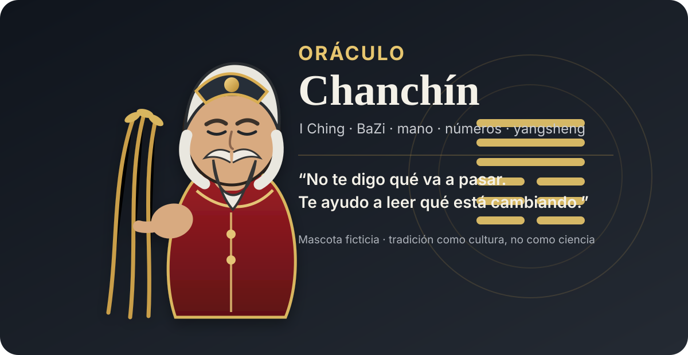

<p align="center">
  
</p>

<h1 align="center">☯ Oráculo Chanchín ☯</h1>

<p align="center">
  <strong>周易 · 八字 · 掌相 · 医易 · 养生</strong><br>
  <em>Seis líneas. Ocho caracteres. Dos manos. Un montón de preguntas incómodas.</em>
</p>

<p align="center">
  <code>I Ching</code> · <code>BaZi</code> · <code>Quiromancia comparada</code> · <code>Numerología</code> · <code>Yangsheng</code> · <code>Tratados clásicos</code>
</p>

---

> **“El oráculo no te entrega el futuro. Te muestra la forma que está tomando el cambio.”**

## 🏮 El umbral

Dicen que, mucho antes de que una máquina pudiera leer millones de palabras en segundos, hubo personas que intentaron ordenar el caos mirando **el cielo, las estaciones, los ciclos, las líneas de una mano y seis trazos de yin y yang**.

De esa obsesión humana por encontrar estructura en lo incierto nacieron tradiciones como el **Zhou Yi / I Ching (周易)**, los **Cuatro Pilares o BaZi (八字)**, los sistemas fisiognómicos de la antigua China y las prácticas de **yangsheng (养生)**.

**Oráculo Chanchín** es un experimento moderno construido sobre esas fuentes: una skill en español que hace que una IA lea varios de esos mapas simbólicos **a la vez**, los confronte entre sí y busque coincidencias, contradicciones y silencios.

No hay bola de cristal.

Hay cálculos, reglas, textos antiguos, seis líneas que pueden mutar y un viejo maestro ficticio que se niega a responder con frases de horóscopo.

Bienvenido al templo.

---

## 🧙‍♂️ La leyenda del Maestro Chanchín

El **Maestro Chanchín** no existió. Al menos no en los registros conocidos.

La leyenda del repositorio cuenta que fue un lector errante que cargaba tres cosas:

1. un manojo de tallos para consultar el **Libro de los Cambios**;
2. un cuaderno con los **Diez Tallos Celestes y las Doce Ramas Terrestres**;
3. una regla escrita al borde de todas sus páginas:

> **“Si una lectura podría servirle a cualquiera, no sirve para nadie.”**

Por eso Chanchín no trabaja con una sola señal. Cruza sistemas.

Si la mano dice una cosa, BaZi otra y el I Ching una tercera, **la contradicción se conserva**. Si dos o más mapas apuntan al mismo patrón, la convergencia gana peso dentro del experimento.

La estética del personaje toma inspiración libre de la antigua figura china del **wū (巫)** —especialistas rituales y mediadores descritos en contextos históricos—, pero Chanchín es deliberadamente ficticio: mascota, narrador y guardián de la metodología.

---

## 🔥 Lo que hay detrás del humo

Oráculo Chanchín no es un prompt largo vestido de túnica.

La versión **1.5.x** contiene cálculos, catálogos y cruces reproducibles:

| Instrumento | Qué hace |
|---|---|
| **I Ching / 周易** | 64 hexagramas, trigramas, líneas mutantes, núcleo y resultante |
| **BaZi / 八字** | cuatro pilares, tallos, ramas, cinco fases, Diez Dioses, términos solares y ciclos |
| **医易** | cruza trigramas/hexagramas con correspondencias tradicionales de tratado |
| **Lectura de manos** | separa lo que realmente se ve en una foto de lo que sería inventado |
| **Tratado** | reúne asociaciones históricas de zangfu, patrones, 食疗, hierbas y alimentos |
| **Numerología** | capa occidental auxiliar para comparación |
| **Cruce automático** | enfrenta BaZi × I Ching × números × marcas verificadas y prioriza convergencias |
| **Consulta única** | `carta.py` puede ejecutar el recorrido completo desde una sola entrada |

La regla metodológica es sencilla:

```text
OBSERVAR → CALCULAR → CRUZAR → INTERPRETAR
```

No al revés.

---

## ☰☱☲☳☴☵☶☷ I Ching en un minuto

Todo comienza con dos posibilidades:

```text
━━━━━━   yang
━━  ━━   yin
```

Tres líneas forman un **trigrama**. Existen ocho trigramas básicos:

```text
☰ Qian   Cielo       ☱ Dui    Lago
☲ Li     Fuego       ☳ Zhen   Trueno
☴ Xun    Viento      ☵ Kan    Agua
☶ Gen    Montaña     ☷ Kun    Tierra
```

Dos trigramas forman un **hexagrama** de seis líneas. Las combinaciones tradicionales dan los **64 hexagramas** del *Zhou Yi*.

Una consulta puede contener líneas estables y líneas **mutantes**. Cuando una línea cambia, el oráculo no entrega solamente una figura:

```text
PRESENTE  ── lo que está configurado ahora
    ↓
NÚCLEO    ── la estructura interna del hexagrama
    ↓
MUTACIÓN  ── dónde se concentra el movimiento
    ↓
RESULTANTE── la figura obtenida tras el cambio
```

Consulta con distribución de varillas:

```bash
python3 scripts/iching.py \
  --pregunta "¿Acepto esta sociedad?" \
  --metodo varillas
```

O entrega las seis líneas directamente, **siempre de abajo hacia arriba**:

```bash
python3 scripts/iching.py --lineas 7,8,9,8,7,6
```

El modo `varillas` reproduce la **distribución probabilística tradicional** asociada al método de tallos de milenrama; no simula físicamente los 49 tallos uno por uno.

---

## 🐉 BaZi: los ocho caracteres

BaZi (八字) significa literalmente **“ocho caracteres”**.

Un nacimiento se representa mediante cuatro pilares:

| Pilar | Tallo Celeste | Rama Terrestre |
|---|---:|---:|
| Año | 1 carácter | 1 carácter |
| Mes | 1 carácter | 1 carácter |
| Día | 1 carácter | 1 carácter |
| Hora | 1 carácter | 1 carácter |

Cuatro pilares × dos caracteres = **ocho caracteres**.

El sistema analiza, entre otras cosas:

- cinco fases: Madera, Fuego, Tierra, Metal y Agua;
- polaridad yin/yang;
- tallos ocultos;
- relaciones de los **Diez Dioses**;
- fuerza relativa del **Amo del Día**;
- clima estacional;
- términos solares;
- Grandes Ciclos.

Ejemplo:

```bash
python3 scripts/bazi.py \
  --fecha 1995-02-12 \
  --hora 16:30 \
  --sexo M \
  --tz America/Santiago \
  --lon -70.65
```

Sin hora conocida:

```bash
python3 scripts/bazi.py \
  --fecha 1995-02-12 \
  --sexo M \
  --tz America/Santiago \
  --lon -70.65 \
  --sin-hora
```

El año BaZi **no cambia simplemente el 1 de enero**. La implementación respeta el marco de términos solares y el corte de **Lichun (立春)** usado por la metodología del proyecto.

---

## ✋ La mano no habla si la foto no muestra

La lectura de mano tiene una regla especialmente estricta:

> **Marca no visible = marca inexistente para la lectura.**

La skill separa primero la observación de la interpretación:

- forma general de palma y dedos;
- proporciones;
- relieve;
- líneas principales;
- ramas, cortes e islas realmente observables;
- comparación entre ambas manos solo cuando luz, escala y pose lo permiten.

Después puede cruzar una marca verificable con el catálogo tradicional.

No se permite convertir un borrón, una sombra o una compresión de cámara en una profecía.

Más detalle: [`docs/FOTO-Y-VERIFICACION.md`](docs/FOTO-Y-VERIFICACION.md).

---

## 🧿 La consulta completa

La puerta principal es `carta.py`.

Puede combinar carta natal, números, I Ching y marcas de palma en una sola ejecución:

```bash
python3 scripts/carta.py \
  --nombre "Nombre Completo" \
  --usado "Nombre de uso" \
  --fecha 1990-05-12 \
  --hora 14:30 \
  --sexo M \
  --tz America/Santiago \
  --lon -70.65 \
  --pregunta "¿Acepto el socio?" \
  --metodo varillas \
  --marcas "isla en línea de cabeza; meñique corto o bajo"
```

El bloque de **cruce automático** intenta ordenar el resultado en tres categorías:

```text
CONVERGENCIA  → varios mapas apuntan a algo parecido
DIVERGENCIA   → los mapas chocan entre sí
SILENCIO      → un sistema no aporta evidencia útil
```

Una divergencia no se borra para que la lectura se vea bonita.

---

## 📜 Los libros detrás del oráculo

El proyecto no atribuye todo a un misterioso “manuscrito ancestral”. Cada familia textual cumple una función distinta.

### 周易 — *Zhou Yi / I Ching*

La arquitectura de trigramas, hexagramas, líneas y transformación.

### 黄帝内经 — *Huangdi Neijing*

Marco histórico de yin-yang, cinco fases, estaciones y **yangsheng (养生)**.

### 穷通宝鉴 — *Qiongtong Baojian*

Referencia tradicional para la capa climática/estacional usada en escuelas de BaZi.

### 滴天髓 — *Di Tian Sui*

Texto influyente en la tradición de los ocho caracteres, especialmente en balance y dinámica de las cinco fases.

### 麻衣神相 — *Ma Yi Shen Xiang*

Familia textual fisiognómica asociada tradicionalmente a la escuela de Ma Yi.

### 神相全编 — *Shen Xiang Quan Bian*

Compilación tradicional de observación fisiognómica: estructura, forma, cinco fases y color/qi dentro de su marco histórico.

La documentación ampliada está en [`docs/FUENTES-CLASICAS.md`](docs/FUENTES-CLASICAS.md) y [`references/fuentes.md`](references/fuentes.md).

**Importante:** estos textos pertenecen a épocas, escuelas y tradiciones diferentes. El proyecto no pretende que constituyan una doctrina única ni que sus afirmaciones hayan sido validadas por la ciencia moderna.

---

## 🍵 Tratado, 医易 y yangsheng

Aquí está una de las partes más extrañas —y deliberadamente documentadas— de la 1.5.x.

La skill puede **mostrar el vocabulario que los tratados asocian** a tallos, fases, trigramas y marcas: zangfu, patrones, nombres tradicionales de enfermedades, alimentos, tés y hierbas.

Ejemplos:

```bash
python3 scripts/tratado.py --tallo 甲
python3 scripts/tratado.py --hexagrama 64
python3 scripts/tratado.py --marca "isla en línea de cabeza"
```

El propósito es conservar y explorar **lo que dice el corpus tradicional**, no transformarlo silenciosamente en medicina contemporánea.

Por eso el oráculo puede decir:

> “este tratado relaciona X con Y”

pero no debe convertir eso en:

> “tú tienes Y”

ni en una dosis, pauta clínica o sustitución de atención profesional.

---

## ⚔️ El juramento de Chanchín

Antes de abrir el libro, el Maestro impone seis reglas:

1. **Una línea de la mano no entrega años de vida.**
2. **Una asociación histórica no es un diagnóstico.**
3. **Una hierba nombrada por un tratado no es una receta.**
4. **Una tradición antigua no se vuelve ciencia moderna porque la procese una IA.**
5. **El I Ching no garantiza pareja, riqueza, empleo, enfermedad ni muerte.**
6. **Si el dato no está, Chanchín se calla.**

La intención no es amputar el contenido histórico. Al contrario: se conserva el vocabulario del tratado **con su etiqueta de procedencia**.

### El estatuto de verdad

- No diagnostica enfermedades a partir de la mano, BaZi o I Ching.
- No prescribe hierbas, suplementos, dosis ni tratamientos.
- No calcula esperanza de vida con la “línea de la vida”.
- No afirma que una tradición simbólica esté validada por la ciencia moderna.
- No garantiza resultados: pareja, trabajo, dinero, salud o muerte.
- No convierte cada marca de la palma en una patología.

Este proyecto es un **experimento de IA + cultura ancestral**. No constituye una verdad revelada, diagnóstico médico ni predicción garantizada.

Más detalle: [`docs/SEGURIDAD-Y-LIMITES.md`](docs/SEGURIDAD-Y-LIMITES.md).

---

## 🪬 Invocar la skill

Validar el repositorio:

```bash
python3 tools/validate.py
python3 scripts/iching.py --validar
```

Construir el paquete instalable:

```bash
python3 tools/build_skill.py
```

Resultado:

```text
dist/oraculo-chanchin.skill
```

---

## 🏯 El templo por dentro

```text
oraculo-chanchin/
├── SKILL.md
├── README.md
├── CHANGELOG.md
├── VERSION
├── assets/
│   ├── maestro-chanchin.svg
│   └── plantilla-informe.md
├── docs/
│   ├── COMO-FUNCIONA.md
│   ├── EXPERIMENTO.md
│   ├── FOTO-Y-VERIFICACION.md
│   ├── FUENTES-CLASICAS.md
│   └── SEGURIDAD-Y-LIMITES.md
├── references/
├── scripts/
│   ├── bazi.py
│   ├── carta.py
│   ├── cruce.py
│   ├── iching.py
│   ├── iching_salud.py
│   ├── tratado.py
│   └── tratado_salud.py
└── tools/
    ├── build_skill.py
    └── validate.py
```

---

## 🌘 Sobre el experimento

¿Por qué hacer esta wea?

Porque los modelos modernos son excelentes reconociendo patrones, pero las tradiciones simbólicas antiguas son sistemas llenos de reglas internas, excepciones, correspondencias y capas históricas. Eso las vuelve un terreno raro e interesante para probar si una IA puede:

- seguir una metodología sin diluirla en frases genéricas;
- sostener varias interpretaciones contradictorias;
- separar cálculo de observación;
- distinguir fuente histórica de afirmación moderna;
- y decir **“no hay dato suficiente”** cuando corresponde.

El objetivo no es demostrar que el universo funciona como un hexagrama.

El objetivo es ver hasta dónde puede llegar una máquina cuando entra a un mapa antiguo **sin romperlo para hacerlo caber en una respuesta fácil**.

Lee [`docs/EXPERIMENTO.md`](docs/EXPERIMENTO.md) para el planteamiento completo.

---

<p align="center">
  <strong>☯ 天 · 地 · 人 ☯</strong><br>
  <em>Cielo · Tierra · Persona</em><br><br>
  <strong>Oráculo Chanchín</strong><br>
  Un experimento abierto de IA, texto antiguo y lectura comparada.
</p>

## Licencia

Código y documentación propia: **MIT**. Los títulos clásicos citados pertenecen a sus respectivas tradiciones y ediciones. El repositorio no redistribuye traducciones modernas protegidas completas.
